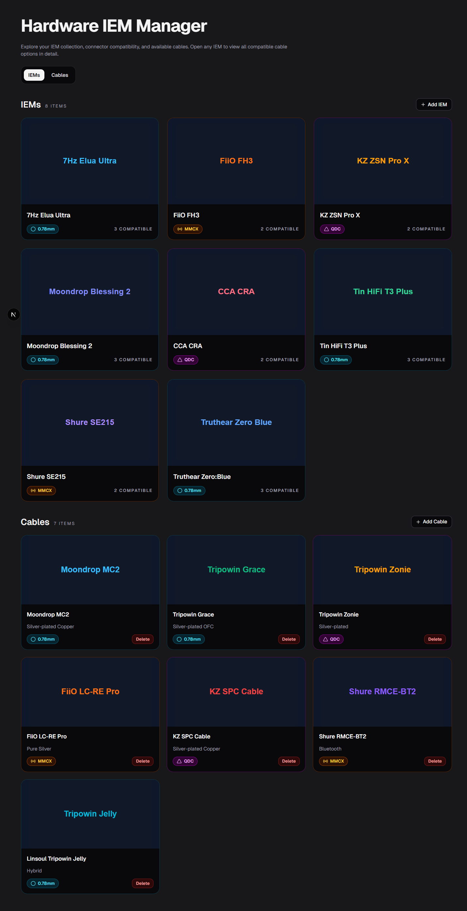
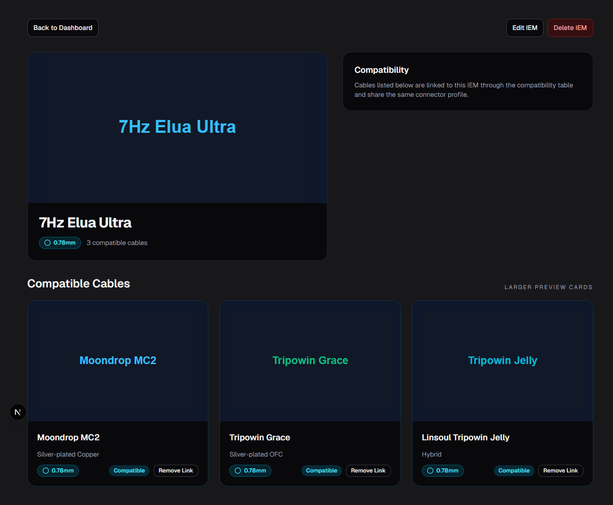
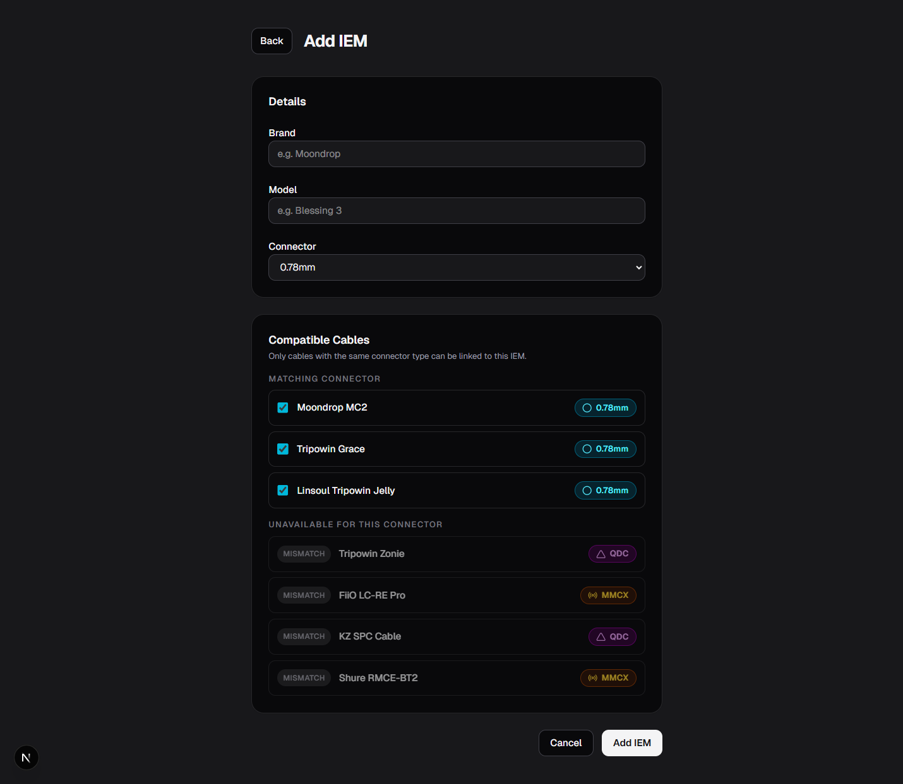
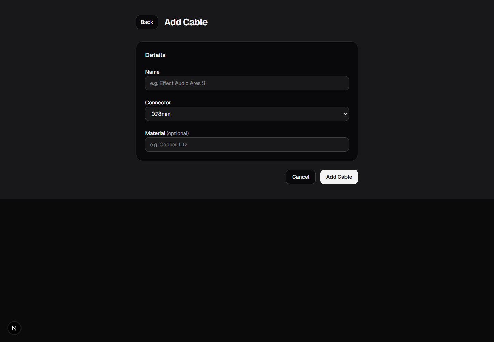
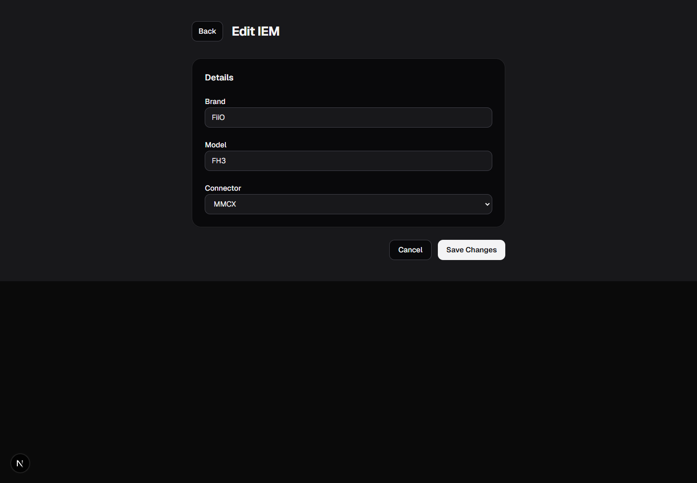
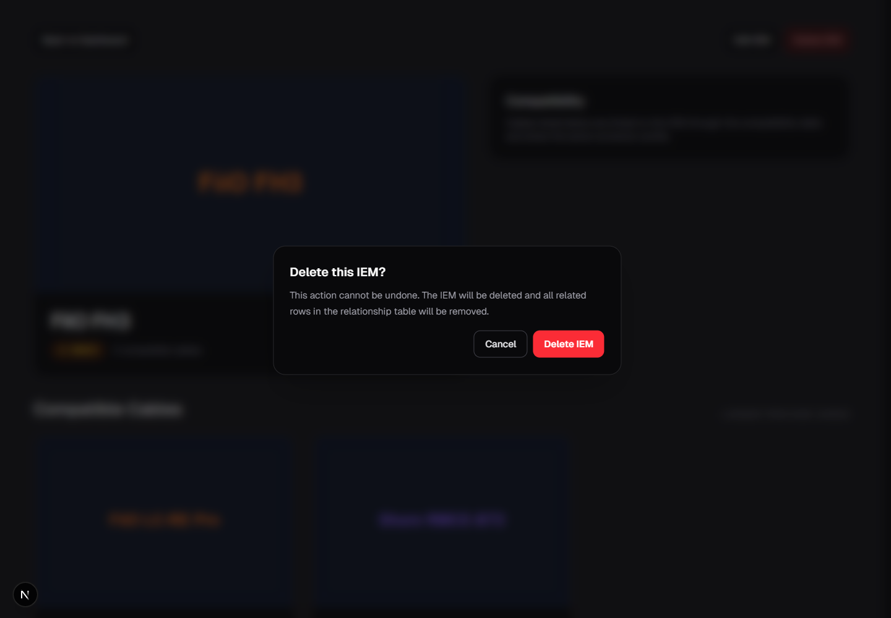

# Hardware IEM Manager

Hardware IEM Manager is a full-stack app for managing IEMs, cables, and the compatibility links between them. The stack is a Next.js frontend, an Express + Drizzle backend, and PostgreSQL, with Docker Compose for local development.

## Screenshots

### Dashboard
Overview of IEMs and cables on the home page.



### IEM Detail
Selected IEM with compatibility list and actions.



### Add IEM
Form to create a new IEM and preselect compatible cables.



### Edit IEM
Form to update IEM details and connector type.



### Add Cable
Form to add a new cable to the collection.



### Additional View
Extra captured page state from the app.



## Tech Stack
- Frontend: Next.js, React, TypeScript, Tailwind CSS
- Backend: Express, Drizzle ORM, Zod
- Database: PostgreSQL
- UI primitives: Radix Alert Dialog via shadcn-style wrapper
- Tooling: Docker Compose, ESLint, Prettier

## Current Scope
- Browse IEMs and cables from the dashboard
- View an IEM and its compatible cables
- Create IEMs and cables
- Edit IEMs
- Delete IEMs and cables with confirmation dialogs
- Add and remove compatibility links
- Enforce connector compatibility in the backend

Current non-goals / gaps:
- No source gear module
- No dedicated cable detail page
- No active cable edit route in the current frontend route tree

## Repository Layout

```text
.
├── docker-compose.yml
├── gear-tracker-backend/
│   ├── README.md
│   ├── Dockerfile
│   ├── drizzle.config.ts
│   ├── package.json
│   └── src/
└── gear-tracker-frontend/
	├── README.md
	├── Dockerfile
	├── package.json
	├── app/
	├── components/
	├── lib/
	└── styles/
```

## Services

### Frontend
- Next.js App Router
- Runs on `http://localhost:3000`

### Backend
- Express + Drizzle ORM
- Runs on `http://localhost:3001`

### Database
- PostgreSQL 16
- Exposed on `localhost:5432`

## Quick Start

### Prerequisites
- Docker Desktop / Docker Engine
- Docker Compose
- Node.js 18+ if you want to run frontend or backend outside containers

### Start the full stack
From the repository root:

```bash
docker compose up --build
```

Open:
- Frontend: `http://localhost:3000`
- Backend health endpoint: `http://localhost:3001/health`

### Stop the stack
```bash
docker compose down
```

### Reset containers and database volume
```bash
docker compose down -v
```

## Docker Development Behavior
- The backend waits for Postgres, pushes schema, reseeds the database, then starts watch mode
- The frontend runs in Next.js development mode with polling enabled for container-friendly file watching
- Both frontend and backend source directories are bind-mounted for live development

Important seed behavior:
- The backend container runs `npm run db:seed` on startup
- Seeding clears and repopulates the database each time the backend container starts

## High-Level Features
- Relationship-aware compatibility model using `iem_to_cables`
- Backend connector validation before links are created
- Relationship cleanup when deleting IEMs or cables
- Delete confirmation dialogs in the frontend using Radix Alert Dialog
- Connector badge colors remain fixed by connector type
- Cable-related accents are aligned through shared accent mapping in the frontend

## Troubleshooting
- If `docker compose up --build` fails early, confirm Docker is running and ports `3000`, `3001`, and `5432` are free.
- If the frontend cannot reach the backend in Docker, verify `API_INTERNAL_URL=http://backend:3001` is present in `docker-compose.yml`.
- If data seems to reset unexpectedly, that is expected when the backend container restarts because seed runs on startup.
- If file watching seems stale in Docker, recreate the container or restart the stack.

## Documentation
- Backend details: [gear-tracker-backend/README.md](gear-tracker-backend/README.md)
- Frontend details: [gear-tracker-frontend/README.md](gear-tracker-frontend/README.md)